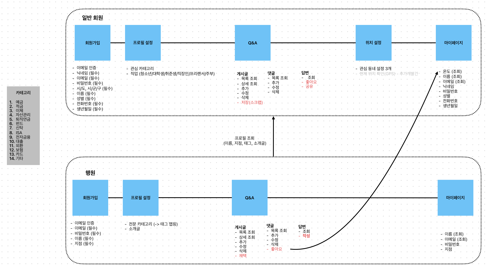

# would-you-hana-FE

📂 우주하나 FE 레포지토리

## 기능 설계

- 디자인 (피그마) : https://www.figma.com/design/ZhkiG9PQ2Vmb9yvyYiM2sE/%EC%9A%B0%EC%A3%BC%ED%95%98%EB%82%98?node-id=19-429&t=jGngtALHef3GQKNk-1
- 작업현황 : https://docs.google.com/spreadsheets/d/1A0TwavJMfvTlRxLEdHKb-eH2mEWoibpTC-R0GjVtaI4/edit?gid=0#gid=0

## 실행 방법

- git clone => https://github.com/WouldYouHana/would-you-hana-FE.git
- `npm install`
- `npm run dev` 실행 => http://localhost:5173/ 접속

## 기술 스택

- "vite": "^5.4.8" 
- "react": "^18.3.1", 
- "tailwindcss": "^3.4.14", 
- "typescript": "^5.5.3",

## 커밋 규칙

- `feat`:새로운 기능 추가
- `fix`: 버그 수정
- `docs`: 문서 수정
- `style`: 코드 포맷팅, 세미클론 누락, 코드 변경이 없는 경우
- `refactor`: 코드 리팩토링
- `test`: 테스트 코드, 리팩토링 테스트 코드 추가
- `chore`: 빌드 업무 수정, 패키지 매니저 수정

## SRC 내부 폴더구조
─ src
 ├─ components
 ├─ assets 
 ├─ hooks (= hoc)
 ├─ pages
 ├─ constants
 ├─ config
 ├─ styles
 ├─ services (= api)
 ├─ utils
 ├─ contexts
 ├─ App.js
 └─ index.js
